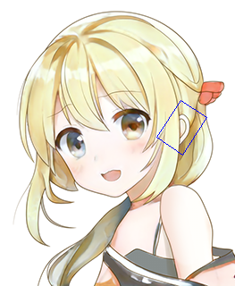

# 粒子群图像匹配

使用了粒子群算法的图像匹配，可以匹配不同缩放和旋转下的图像。

我是不是又一拍脑袋发明了新算法，不过查了一下发现2015年的时候已经有人发过了，要是我早生几年就好了2333

之前本来是想用这个算法做一个断腿立绘拼接工具的，但是没什么动力，正好今天群友问了，看了下GitHub上好像没有Python实现，就自己试着做了出来。


## 示例

原图——


找找耳朵在哪里？


找到了！




## 改进方向

这示例跑一次要三四秒，真是太慢了2333

可以改进的地方其实很多，首先cost不一定要算完，可以先给原图大幅降采样，先在这上面算如果太大就直接跳过了。

而且把第四个通道当作权重乘上去的话，这样对透明图片的匹配也不在话下了。

话说回来，如果把视频当作一张会动的图片，让粒子和视频同时运动，做到实时也不是不可能？

不过我得先看点色图休息一下……


## 使用方法

首先——

```
pip install -r requirements.txt
```

然后试用一下——

```
python 测试.py
```

或者你也可以直接——

```
import 粒子群匹配
```

## 赞助

如果你觉得这个算法对你的工作或作业有帮助，可以把妹妹介绍给我，要可爱的。
